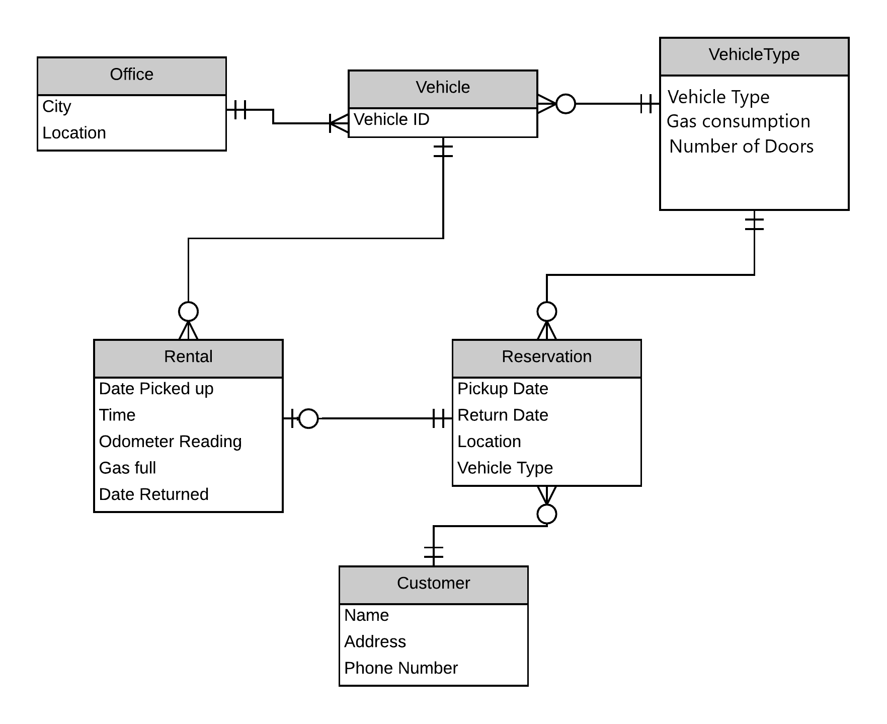
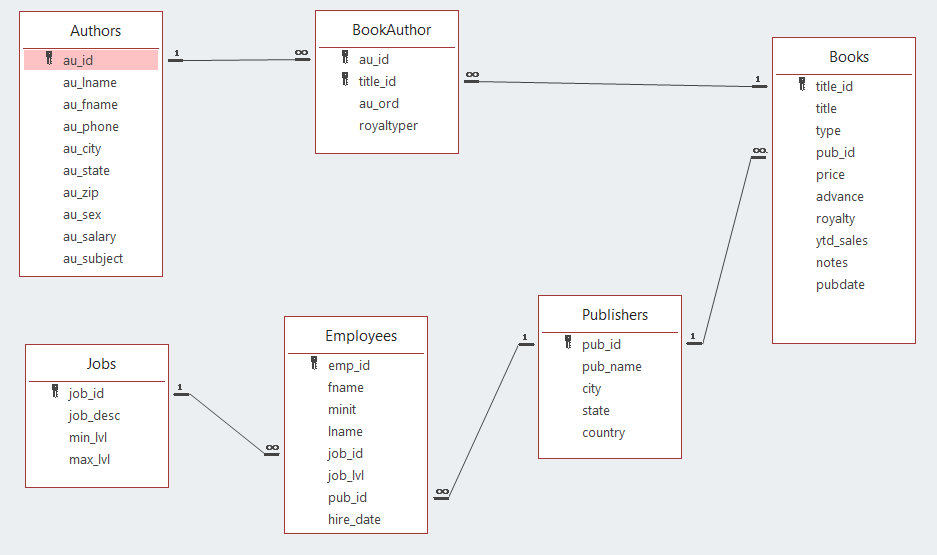

```{r setup, include=FALSE}
#Do not change this Chunk

knitr::opts_chunk$set(echo = FALSE, error = TRUE)

library(tidyverse)
library(ggplot2)
library(DBI)


#enable other connections
# dbDisconnect(con)
#
# connect to CapeCodd
congap <- DBI::dbConnect(RSQLite::SQLite(), "gapminderdb.db")
conbook <- DBI::dbConnect(RSQLite::SQLite(), "books.db")
#


```
## Before you start

Make sure that you have copied the StudentNoteBook to a folder on you computer, as well as the 2 database files. The 2 database files need to be in the same folder as the StudentNoteBook. 

You can test the locataion by running the following code

```{r eval=FALSE, echo=TRUE}
getwd()
```

Make sure it returns your Exam_HandIn folder. If it does not return, save your StudentNoteBook in the Exam_HandIn folder. If you know that you are saving in the Exam_HandIn folder you can continue. 

Now add your name:

Name: K.Mihaylov

Studentnumber:3843718

Class:  PC06


## Introduction text

In this exam we will go over the theory you worked with earlier. In four sections we will focus on some of the questions and theory presented in the course of DDO.
We will start with some questions regarding reading the ERD. Then there are 2 datasets in which we will run several queries, the first you might recognize as the Gapminder, the second is regarding different authors. Lastly we will combine the Queries that you have made with the Tidyverse skills we have obtained earlier in the course.  

As we will be using different libraries you need to enable these:

```{r, eval=FALSE, echo=TRUE}
library(tidyverse)
library(ggplot2)
library(DBI)
```

## When finished

After completing all questions you can save the Notebook. Using the <i> "knit" </i>function to print your work into an HTML file completes the last task of the test. When you want to upload the work with EFIT make sure to close all applications, otherwise you cannot upload. 

When everything is uploaded you can leave the room quietly. 


## Understanding a database

For this assignemnt we have the following ERD: 



in this ERD there are 6 relationships, for the relations would the following be true or false:

1. A vehicle will always have a rental
(One mandatory Vehicle to Many optional rental)
>FALSE
   
2. A Rental will always have 1 Reservation
(One optional rental to One mandatory reservation)
>TRUE

3. A vehicle is listed with one office only
(Many mendatory vehicle to one mendatory office)
>TRUE

4. For every vehicle type there is at least 1 vehicle
(One mandatory vehicle type to Many optional vehicles)
>TRUE

5. Every table will always need a primary key
>FALSE

6. For a reservation it is optional to have a VehicleType
(many optional reservation to one mandatory Vehicle type)
> TRUE

Describe the following relationships in plain English:

7. The relationship between Office and Vehicle
Mandatory one office has mandatory many vehicles.

8. The relationship between Customer and Reservation
One mandatory customer has many optional reservations.

9. The relationship between Rental and Vehicle
Many optional rentals have one mandatory vehicle.

## gapminder queries.

In week 6 we have worked with Gapminder and the tidyverse. Now for the SQL we have the gapminder database available. To see the content of the dataset we can use the following code:

```{sql connection=congap}
SELECT *
FROM gapminder Where country = "Afghanistan" and year < 2000;
```


10. Show the name of countries, year, and life expectation from the table gapminder.

```{sql connection=congap}
SELECT country, year, lifeExp
FROM gapminder Where country = "Afghanistan" and year < 2000;

```


11. List all the countries from the gapminder table. Make sure there are no duplicate lines.

```{sql connection=congap}
SELECT country
FROM gapminder
GROUP BY country;

```


12. List the information of China in 1967 from the Gapminder table

```{sql connection=congap}
SELECT *
FROM gapminder 
WHERE country = "China" and year = 1967;

```


13. What is the total population in 2007 according to the gapminder table

```{sql connection=congap}
SELECT SUM(pop)
FROM gapminder
WHERE year = 2007;
```


14. Calculate the average gdpPercap of each country

```{sql connection=congap}
SELECT country, avg(gdpPercap) as average_gdp
FROM gapminder
GROUP BY country;

```


15. Show the total population, average population, the minimum, and maximum population for Canada

```{sql connection=congap}
SELECT SUM(pop) as total, AVG(pop) as Average, MIN(pop) as minimum, MAX(pop) as maximum
FROM gapminder
WHERE country = "Canada";

```


16. From the database we also have the table countries, give the country and continent code:

```{sql connection=congap}
SELECT country, continent
FROM countries
GROUP BY country;

```


17. how many countries are there per continent?

```{sql connection=congap}
SELECT continent, COUNT(country) as "# of countries"
FROM countries
GROUP BY continent
ORDER BY continent DESC;

```


18. What is the population per continent? 


```{sql connection=congap}
SELECT c.continent, SUM(g.pop) as "population"
FROM countries as c
INNER JOIN gapminder as g on g.country = c.country
GROUP BY c.continent
ORDER BY c.continent DESC;

```


## Books queries

For a second set of queries we have a database with the following database model:



19. Show a list of all authors whose first name starts with the ‘An’ characters.

```{sql connection=conbook}
SELECT *
FROM Authors
WHERE au_fname LIKE "An%";

```


20. Show a list of all authors where the last 4 numbers of the id start with a 3 follow with three numbers.

```{sql connection=conbook}
SELECT *
FROM Authors
WHERE au_id LIKE "%-3___";

```


*21.  list for each zip code the maximum salary and corresponding author. Only Looking at zip codes where the maximum salary is below 10.000.

```{sql connection=conbook}
SELECT au_id, MAX(au_salary) as salary, au_zip
FROM Authors
WHERE au_salary < 10000
ORDER BY au_id;

```


22. What is the total price for books sold from the ‘Algodata Infosystems’ publisher? Use a subquery.

```{sql connection=conbook}
SELECT SUM(price)
FROM Books
WHERE pub_id IN (
                 SELECT pub_id
                 FROM Publishers
                 WHERE pub_name = "Algodata Infosystems"
                );

```


23. List all employees who are involved in publishing a book for the Binnet & Hardley publisher. (use a subquery).

```{sql connection=conbook}
SELECT e.fname, e.lname, e.emp_id
FROM Employees AS e
WHERE e.pub_id IN (
      SELECT p.pub_id
      FROM Publishers AS P
      WHERE p.pub_name = "Binnet & Hardley"

);

```


*24. What is the total number of business books that are written per gender of the author? 
List gender and the total number of books.

```{sql connection=conbook}
SELECT COUNT(au_id), au_sex
FROM Authors
WHERE au_id IN (
        SELECT au_id
        FROM BookAuthor
        WHERE title_id LIKE "BU%"
)
GROUP BY au_sex;

```


25. Who wrote the book with title ‘Is Anger the Enemy?’? 
List the first and the last names of the author and the author id.

```{sql connection=conbook}
SELECT au_fname, au_lname, au_id
FROM Authors
WHERE au_id IN (
        SELECT au_id
        FROM BookAuthor
        WHERE title_id = "PS2091"
);

```


## Combining SQL and the tidyverse

In this section we will use the gapminder and courtries dataset. When joining these you do this on country. After making the appropriate query you can use the tidyverse library to make the plots.
Which code is used to get the below mentioned graphs?

26. compare the gdpPercap against the lifeExp for 2007 only. (use the gapminder database.)

```{sql connection=congap,output.var="DF26"}
SELECT *
FROM gapminder;
```


```{r}
ggplot(data = DF26, aes(x=gdpPercap,y=lifeExp, color=gdpPercap)) + geom_point() + scale_y_log10()
```


27. If we want to compare the countries in Oceania with each other on the growth in population over the years we could use the following graph. (use the gapminder database.)


```{sql connection=congap,output.var="DF27"}
SELECT *
FROM gapminder;

```


```{r}
ggplot(data = DF27, aes(x=gdpPercap,y=lifeExp, color=gdpPercap)) + geom_point() + scale_y_log10()
```

28. One of the reasons in growth is the life expectancy. The life expectancy is in its turn related to the gdp. To get a view for both countries we can have a look at the following graphs. Plot the lief expectancy against the gdpPercap for both countries. use the population to indicate the growth.  (use the gapminder database.)


```{sql connection=congap,output.var="DF28"}

```


```{r}
DF28
```

29. In the Books database we want to see how many books are published per state of the Authors. (use the books database.)


```{sql connection=conbook,output.var="DF29"}

```


```{r}
DF29
```

## End of test

Make sure to save everything in the right folder. 

In the submission folder you include, your notebook, databases and HTML file. 

Before you hit submit, make sure to close all other applications, including your browser and Rstudio!!

Then hit submit.